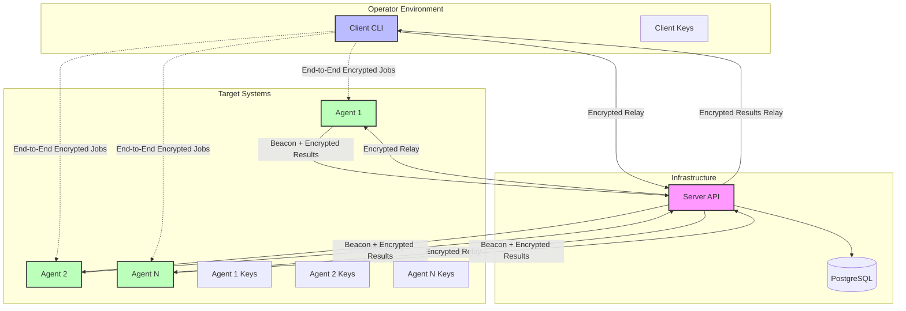
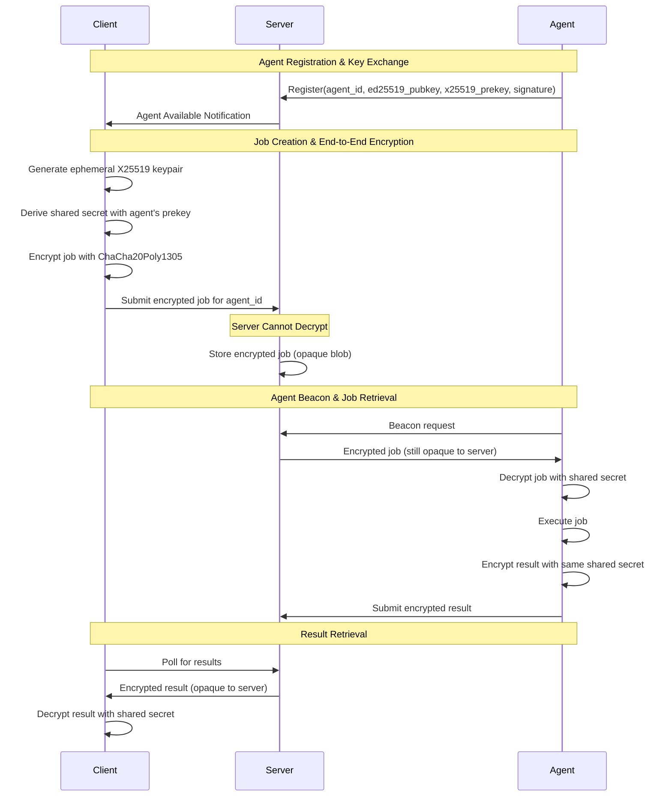
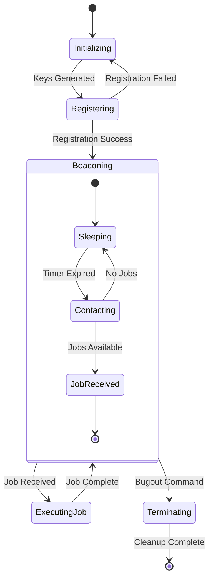

# Design Document

## Overview

VenomMonkey is designed as an educational distributed beacon system with three core components: lightweight agents (beacons), a central coordination server, and a client management interface. The system serves as a learning platform for cybersecurity education, allowing students and security professionals to understand threat actor techniques, practice defensive measures, and conduct authorized security research in controlled environments.

**Educational Focus**: The system is specifically designed for:

- Cybersecurity education and training programs
- Authorized penetration testing in controlled lab environments
- Security research and defensive technique development
- Red team training exercises with proper authorization
- Understanding distributed system security architectures

The architecture follows a zero-trust model where the server acts as an encrypted relay without access to job contents or the ability to impersonate agents. This design ensures that server compromise cannot lead to agent takeover or job content disclosure, providing an excellent case study for secure distributed system design.

## Architecture

### High-Level System Architecture



### Cryptographic Architecture



## Components and Interfaces

### Agent Component

The agent is a lightweight, cross-platform beacon designed for stealth and persistence.

#### Agent Architecture

```rust
// Core agent structure
pub struct Agent {
    identity: Ed25519KeyPair,
    machine_id: String,
    hostname: String,
    server_url: Url,
    beacon_interval: Duration,
    persistence_manager: Box<dyn PersistenceManager>,
    crypto_engine: CryptoEngine,
}

// Platform-specific persistence
pub trait PersistenceManager: Send + Sync {
    fn establish_persistence(&self) -> Result<()>;
    fn remove_persistence(&self) -> Result<()>;
    fn is_persistent(&self) -> bool;
}

// Crypto operations
pub struct CryptoEngine {
    identity_keypair: Ed25519KeyPair,
    prekey_keypair: X25519KeyPair,
}
```

#### Agent State Machine



#### Platform-Specific Implementations with Advanced OPSEC Techniques

**Linux Implementation (Advanced Educational Techniques):**

- **Memory-Only Execution**: Use `memfd-runner` for fileless execution from memory
- **Process Hollowing**: Inject into legitimate processes for stealth
- **Persistence**: systemd service, cron jobs, or LD_PRELOAD hijacking
- **Configuration**: Encrypted storage using `secrecy` crate in `/dev/shm` (memory filesystem)
- **Anti-Forensics**: Secure memory handling with automatic zeroization
- **Network Evasion**: JA4 fingerprint randomization and domain fronting

```rust
// Linux-specific advanced techniques for educational purposes
pub struct LinuxAdvancedAgent {
    memfd_runner: MemfdRunner,         // Fileless execution
    process_hollower: ProcessHollower, // Process injection
    anti_forensics: AntiForensics,     // Memory protection with secrecy
    ja4_evader: Ja4Evader,             // Network fingerprint evasion
}

impl LinuxAdvancedAgent {
    /// Execute payload directly from memory without touching disk
    /// Educational Note: This technique prevents forensic disk analysis
    /// by never writing the payload to persistent storage
    pub fn execute_from_memory(&self, payload: &[u8]) -> Result<()> {
        let memfd = self.memfd_runner.create_anonymous_file()?;
        memfd.write_all(payload)?;
        memfd.execute_with_args(&[])?;
        // Memory is automatically cleaned up when memfd goes out of scope
        Ok(())
    }

    /// Inject into legitimate process for stealth
    /// Educational Note: This makes detection harder as malicious
    /// code runs within a legitimate process context
    pub fn inject_into_process(&self, target_pid: u32, payload: &[u8]) -> Result<()> {
        self.process_hollower.inject(target_pid, payload)
    }
}
```

**Windows Implementation (Advanced Educational Techniques):**

- **DLL Injection**: Use `dll-syringe` for sophisticated process injection
- **Reflective DLL Loading**: Load DLLs directly from memory
- **AMSI Bypass**: Evade Windows Defender and other AV solutions
- **ETW Evasion**: Bypass Event Tracing for Windows monitoring
- **Persistence**: Multiple vectors including WMI, scheduled tasks, and service hijacking
- **Anti-Forensics**: Secure string handling with `secrecy` and memory encryption

```rust
// Windows-specific advanced techniques for educational purposes
pub struct WindowsAdvancedAgent {
    dll_syringe: DllSyringe,             // Advanced DLL injection
    amsi_bypasser: AmsiBypasser,         // AV evasion
    etw_evader: EtwEvader,               // Logging evasion
    reflective_loader: ReflectiveLoader, // Memory-only DLL loading
    secure_strings: SecretVec<u8>,       // Secure memory with secrecy crate
}

impl WindowsAdvancedAgent {
    /// Inject DLL into target process using advanced techniques
    /// Educational Note: This demonstrates how attackers can execute
    /// code within legitimate processes to evade detection
    pub fn inject_dll(&self, target_process: &str, dll_bytes: &[u8]) -> Result<()> {
        let target = self.dll_syringe.find_target(target_process)?;

        // Use reflective DLL loading to avoid disk writes
        let injector = target.inject_reflective_dll(dll_bytes)?;

        // Call DLL entry point with stealth parameters
        injector.call_exported_function("DllMain", &[1, 0, 0])?;

        Ok(())
    }

    /// Bypass AMSI (Anti-Malware Scan Interface)
    /// Educational Note: This shows how attackers evade Windows
    /// built-in malware scanning capabilities
    pub fn bypass_amsi(&self) -> Result<()> {
        self.amsi_bypasser.patch_amsi_scan_buffer()?;
        Ok(())
    }

    /// Evade ETW (Event Tracing for Windows)
    /// Educational Note: This prevents Windows from logging
    /// security-relevant events that defenders rely on
    pub fn evade_etw(&self) -> Result<()> {
        self.etw_evader.disable_etw_providers(&[
            "Microsoft-Windows-Kernel-Process",
            "Microsoft-Windows-Security-Auditing",
        ])?;
        Ok(())
    }
}
```

**macOS Implementation (Advanced Educational Techniques):**

- **Code Signing Bypass**: Techniques for unsigned code execution
- **SIP Bypass**: System Integrity Protection evasion methods
- **Persistence**: LaunchAgents, LoginItems, and kernel extension techniques
- **Anti-Forensics**: Secure enclave utilization and memory protection with `secrecy`
- **Network Evasion**: Certificate pinning bypass and traffic obfuscation

```rust
// macOS-specific advanced techniques for educational purposes
pub struct MacOSAdvancedAgent {
    code_signer: CodeSignBypasser,        // Signature evasion
    sip_evader: SipEvader,                // System protection bypass
    secure_enclave: SecureEnclaveManager, // Hardware security utilization
    secure_memory: SecretVec<u8>,         // Secure memory with secrecy crate
}

impl MacOSAdvancedAgent {
    /// Bypass code signing requirements
    /// Educational Note: This shows how attackers can execute
    /// unsigned code on systems with strict signing policies
    pub fn bypass_code_signing(&self, binary_path: &Path) -> Result<()> {
        self.code_signer.remove_signature(binary_path)?;
        self.code_signer.inject_fake_signature(binary_path)?;
        Ok(())
    }

    /// Utilize secure enclave for key storage
    /// Educational Note: This demonstrates both offensive and defensive
    /// use of hardware security features
    pub fn store_key_in_enclave(&self, key: &[u8]) -> Result<SecureEnclaveKey> {
        self.secure_enclave.store_key(key)
    }
}
```

#### Network Evasion Techniques (Cross-Platform)

```rust
// JA4 fingerprint evasion for educational purposes
pub struct Ja4Evader {
    user_agents: Vec<String>,
    tls_configs: Vec<TlsConfig>,
    http_headers: Vec<HeaderSet>,
}

impl Ja4Evader {
    /// Randomize JA4 fingerprint to evade network detection
    /// Educational Note: JA4 is a newer fingerprinting method that
    /// can identify clients based on TLS and HTTP characteristics
    pub fn randomize_fingerprint(&mut self) -> Result<HttpClient> {
        let random_ua = self.user_agents.choose(&mut thread_rng()).unwrap();
        let random_tls = self.tls_configs.choose(&mut thread_rng()).unwrap();
        let random_headers = self.http_headers.choose(&mut thread_rng()).unwrap();

        let client = HttpClient::builder()
            .user_agent(random_ua)
            .tls_config(random_tls.clone())
            .default_headers(random_headers.clone())
            .build()?;

        Ok(client)
    }

    /// Implement domain fronting for traffic obfuscation
    /// Educational Note: This technique hides the true destination
    /// of network traffic by using CDN infrastructure
    pub fn setup_domain_fronting(&self, real_domain: &str, front_domain: &str) -> Result<()> {
        // Configure HTTP client to use front domain in SNI
        // but real domain in Host header
        Ok(())
    }
}
```

### Server Component

The server acts as an encrypted relay and coordination point without access to job contents.

#### Server Architecture

```rust
// Server state management
pub struct ServerState {
    agent_registry: Arc<RwLock<AgentRegistry>>,
    job_queue: Arc<JobQueue>,
    database: Arc<Database>,
    crypto_verifier: CryptoVerifier,
}

// Agent registry for tracking active agents
pub struct AgentRegistry {
    agents: HashMap<AgentId, AgentInfo>,
    last_beacon: HashMap<AgentId, Instant>,
}

// Job queue for encrypted job storage
pub struct JobQueue {
    pending_jobs: HashMap<AgentId, Vec<EncryptedJob>>,
    completed_jobs: HashMap<JobId, EncryptedResult>,
}

// Encrypted job structure (opaque to server)
pub struct EncryptedJob {
    job_id: JobId,
    target_agent: AgentId,
    encrypted_payload: Vec<u8>, // Server cannot decrypt this
    created_at: DateTime<Utc>,
    client_signature: Vec<u8>,
}
```

#### API Design

The server provides a RESTful API with the following endpoints:

```rust
// Agent management endpoints
POST   /api/v1/agents/register     // Agent registration
POST   /api/v1/agents/{id}/beacon  // Agent beacon
GET    /api/v1/agents              // List agents (client)
DELETE /api/v1/agents/{id}         // Remove agent (client)

// Job management endpoints
POST   /api/v1/jobs                // Create job (client)
GET    /api/v1/jobs/{id}           // Get job status (client)
GET    /api/v1/jobs/{id}/result    // Get job result (client)

// System endpoints
GET    /api/v1/health              // Health check
GET    /api/v1/metrics             // System metrics
```

#### Database Schema

```sql
-- Agents table (stores public information only)
CREATE TABLE agents (
    id UUID PRIMARY KEY,
    machine_id VARCHAR(255) UNIQUE NOT NULL,
    hostname VARCHAR(255) NOT NULL,
    public_key BYTEA NOT NULL,  -- Ed25519 public key
    prekey BYTEA NOT NULL,      -- X25519 public prekey
    prekey_signature BYTEA NOT NULL,
    registered_at TIMESTAMPTZ NOT NULL DEFAULT NOW(),
    last_beacon TIMESTAMPTZ,
    status VARCHAR(50) NOT NULL DEFAULT 'active'
);

-- Jobs table (stores encrypted payloads only)
CREATE TABLE jobs (
    id UUID PRIMARY KEY,
    agent_id UUID NOT NULL REFERENCES agents(id),
    encrypted_payload BYTEA NOT NULL,  -- Server cannot decrypt
    client_signature BYTEA NOT NULL,
    created_at TIMESTAMPTZ NOT NULL DEFAULT NOW(),
    status VARCHAR(50) NOT NULL DEFAULT 'pending'
);

-- Job results table (stores encrypted results only)
CREATE TABLE job_results (
    job_id UUID PRIMARY KEY REFERENCES jobs(id),
    encrypted_result BYTEA NOT NULL,  -- Server cannot decrypt
    agent_signature BYTEA NOT NULL,
    completed_at TIMESTAMPTZ NOT NULL DEFAULT NOW()
);

-- Users table (for client authentication)
CREATE TABLE users (
    id UUID PRIMARY KEY,
    username VARCHAR(255) UNIQUE NOT NULL,
    public_key BYTEA NOT NULL,  -- Ed25519 public key for auth
    created_at TIMESTAMPTZ NOT NULL DEFAULT NOW(),
    last_login TIMESTAMPTZ
);

-- Indexes for performance
CREATE INDEX idx_agents_machine_id ON agents(machine_id);
CREATE INDEX idx_agents_last_beacon ON agents(last_beacon);
CREATE INDEX idx_jobs_agent_id_status ON jobs(agent_id, status);
CREATE INDEX idx_jobs_created_at ON jobs(created_at);
```

### Client Component

The client provides a CLI interface for managing agents and creating jobs with end-to-end encryption.

#### Client Architecture

```rust
// Client state and configuration
pub struct Client {
    identity: Ed25519KeyPair,
    server_url: Url,
    http_client: reqwest::Client,
    crypto_engine: ClientCryptoEngine,
    config: ClientConfig,
}

// Client-side crypto for end-to-end encryption
pub struct ClientCryptoEngine {
    identity_keypair: Ed25519KeyPair,
    ephemeral_keys: HashMap<JobId, X25519KeyPair>,
}

// CLI command structure
#[derive(Parser)]
pub enum Command {
    Agents {
        #[command(subcommand)]
        action: AgentAction,
    },
    Jobs {
        #[command(subcommand)]
        action: JobAction,
    },
    Identity {
        #[command(subcommand)]
        action: IdentityAction,
    },
}
```

#### CLI Interface Design

```bash
# Agent management
venommonkey agents list                    # List all agents
venommonkey agents show <agent-id>         # Show agent details
venommonkey agents remove <agent-id>       # Remove agent

# Job management
venommonkey jobs create <agent-id> <command>  # Create encrypted job
venommonkey jobs list                         # List jobs
venommonkey jobs show <job-id>               # Show job status
venommonkey jobs result <job-id>             # Get decrypted result

# Identity management
venommonkey identity generate                 # Generate new identity
venommonkey identity show                     # Show current identity
venommonkey identity import <keyfile>         # Import identity

# System operations
venommonkey server connect <url>              # Connect to server
venommonkey config show                       # Show configuration
```

## Data Models

### Core Data Structures

```rust
// Agent identity and metadata
#[derive(Serialize, Deserialize, Clone)]
pub struct AgentInfo {
    pub id: AgentId,
    pub machine_id: String,
    pub hostname: String,
    pub public_key: [u8; 32],      // Ed25519 public key
    pub prekey: [u8; 32],          // X25519 public prekey
    pub prekey_signature: Vec<u8>, // Ed25519 signature of prekey
    pub registered_at: DateTime<Utc>,
    pub last_beacon: Option<DateTime<Utc>>,
    pub status: AgentStatus,
}

// Job structure (encrypted payload)
#[derive(Serialize, Deserialize, Clone)]
pub struct Job {
    pub id: JobId,
    pub agent_id: AgentId,
    pub encrypted_payload: Vec<u8>, // ChaCha20Poly1305 encrypted
    pub client_signature: Vec<u8>,  // Ed25519 signature
    pub created_at: DateTime<Utc>,
    pub status: JobStatus,
}

// Job result (encrypted)
#[derive(Serialize, Deserialize, Clone)]
pub struct JobResult {
    pub job_id: JobId,
    pub encrypted_result: Vec<u8>, // ChaCha20Poly1305 encrypted
    pub agent_signature: Vec<u8>,  // Ed25519 signature
    pub completed_at: DateTime<Utc>,
}

// Plaintext job content (only visible to client and agent)
#[derive(Serialize, Deserialize, Clone)]
pub struct JobContent {
    pub command: String,
    pub arguments: Vec<String>,
    pub environment: HashMap<String, String>,
    pub timeout: Option<Duration>,
    pub working_directory: Option<PathBuf>,
}

// Plaintext job result (only visible to client and agent)
#[derive(Serialize, Deserialize, Clone)]
pub struct JobResultContent {
    pub exit_code: i32,
    pub stdout: String,
    pub stderr: String,
    pub execution_time: Duration,
    pub error: Option<String>,
}
```

### Cryptographic Key Management

```rust
// Key derivation and management
pub struct KeyManager {
    identity_keypair: Ed25519KeyPair,
    prekey_keypair: X25519KeyPair,
}

impl KeyManager {
    // Derive shared secret for job encryption
    pub fn derive_shared_secret(&self, peer_public_key: &[u8; 32]) -> [u8; 32] {
        // X25519 key exchange
        let shared_point = x25519(self.prekey_keypair.secret, peer_public_key);
        // HKDF for key derivation
        hkdf_expand(&shared_point, b"venommonkey-job-encryption", 32)
    }

    // Encrypt job content
    pub fn encrypt_job(&self, content: &JobContent, agent_prekey: &[u8; 32]) -> Result<Vec<u8>> {
        let shared_secret = self.derive_shared_secret(agent_prekey);
        let nonce = ChaCha20Poly1305::generate_nonce();
        let cipher = ChaCha20Poly1305::new(&shared_secret);
        let plaintext = serde_json::to_vec(content)?;
        let ciphertext = cipher.encrypt(&nonce, plaintext.as_slice())?;
        Ok([nonce.as_slice(), &ciphertext].concat())
    }
}
```

## Error Handling

### Error Architecture

The system uses modern Rust error handling with `miette` for user-facing errors and `thiserror` for internal error types.

```rust
// Main error types
#[derive(Error, Diagnostic, Debug)]
pub enum VenomMonkeyError {
    #[error("Cryptographic operation failed")]
    #[diagnostic(
        code(venommonkey::crypto::failed),
        help("Ensure cryptographic libraries are properly initialized")
    )]
    CryptoError(#[from] CryptoError),

    #[error("Network communication failed")]
    #[diagnostic(
        code(venommonkey::network::failed),
        help("Check network connectivity and server availability")
    )]
    NetworkError(#[from] reqwest::Error),

    #[error("Agent registration failed")]
    #[diagnostic(
        code(venommonkey::agent::registration_failed),
        help("Verify server URL and agent credentials")
    )]
    RegistrationError { agent_id: String },

    #[error("Job execution failed")]
    #[diagnostic(
        code(venommonkey::job::execution_failed),
        help("Check job parameters and agent status")
    )]
    JobExecutionError { job_id: JobId, reason: String },
}

// Component-specific error types
#[derive(Error, Debug)]
pub enum CryptoError {
    #[error("Key generation failed")]
    KeyGeneration,
    #[error("Encryption failed: {0}")]
    Encryption(String),
    #[error("Decryption failed: {0}")]
    Decryption(String),
    #[error("Signature verification failed")]
    SignatureVerification,
}
```

### Error Recovery Strategies

```rust
// Retry logic for network operations
pub async fn with_retry<F, T, E>(
    operation: F,
    max_retries: usize,
    base_delay: Duration,
) -> Result<T, E>
where
    F: Fn() -> Pin<Box<dyn Future<Output = Result<T, E>> + Send>>,
    E: std::fmt::Debug,
{
    let mut delay = base_delay;
    for attempt in 0..=max_retries {
        match operation().await {
            Ok(result) => return Ok(result),
            Err(e) if attempt == max_retries => return Err(e),
            Err(_) => {
                tokio::time::sleep(delay).await;
                delay = std::cmp::min(delay * 2, Duration::from_secs(60));
            }
        }
    }
    unreachable!()
}
```

## Testing Strategy

### Testing Architecture

The testing strategy covers unit tests, integration tests, property-based tests, and security tests.

```rust
// Property-based testing for cryptographic operations
#[cfg(test)]
mod crypto_tests {
    use proptest::prelude::*;

    proptest! {
        #[test]
        fn test_encrypt_decrypt_roundtrip(
            plaintext in prop::collection::vec(any::<u8>(), 0..1024)
        ) {
            let key_manager = KeyManager::new();
            let agent_keypair = X25519KeyPair::generate();

            let encrypted = key_manager.encrypt_data(&plaintext, &agent_keypair.public)?;
            let decrypted = key_manager.decrypt_data(&encrypted, &agent_keypair.secret)?;

            prop_assert_eq!(plaintext, decrypted);
        }
    }
}

// Integration tests for end-to-end workflows
#[tokio::test]
async fn test_agent_registration_and_job_execution() {
    let server = test_server().await;
    let agent = test_agent(&server.url()).await;
    let client = test_client(&server.url()).await;

    // Agent registers
    agent.register().await.expect("Registration failed");

    // Client creates job
    let job_id = client.create_job(agent.id(), "echo hello").await?;

    // Agent beacons and receives job
    agent.beacon().await?;

    // Client retrieves result
    let result = client.get_job_result(job_id).await?;
    assert_eq!(result.stdout.trim(), "hello");
}
```

### Security Testing

```rust
// Security-focused tests
#[tokio::test]
async fn test_server_cannot_decrypt_jobs() {
    let server = test_server().await;
    let agent = test_agent(&server.url()).await;
    let client = test_client(&server.url()).await;

    agent.register().await?;

    // Create job with sensitive content
    let sensitive_command = "cat /etc/passwd";
    let job_id = client.create_job(agent.id(), sensitive_command).await?;

    // Verify server database contains only encrypted data
    let job_record = server.get_job_from_db(job_id).await?;

    // Server should not be able to extract the command
    assert!(!String::from_utf8_lossy(&job_record.encrypted_payload)
        .contains("passwd"));

    // Verify the payload is properly encrypted
    assert!(job_record.encrypted_payload.len() > sensitive_command.len());
}

#[test]
fn test_key_zeroization() {
    let mut key_manager = KeyManager::new();
    let key_bytes = key_manager.identity_keypair.secret.to_bytes();

    // Drop the key manager
    drop(key_manager);

    // Verify memory has been zeroized (this is a simplified test)
    // In practice, this would use more sophisticated memory analysis
    assert!(key_bytes.iter().all(|&b| b == 0));
}
```

### Performance Testing

```rust
// Benchmark critical paths
use criterion::{criterion_group, criterion_main, Criterion};

fn bench_job_encryption(c: &mut Criterion) {
    let key_manager = KeyManager::new();
    let agent_prekey = X25519KeyPair::generate().public;
    let job_content = JobContent {
        command: "echo".to_string(),
        arguments: vec!["hello".to_string()],
        environment: HashMap::new(),
        timeout: None,
        working_directory: None,
    };

    c.bench_function("job_encryption", |b| {
        b.iter(|| key_manager.encrypt_job(&job_content, &agent_prekey))
    });
}

criterion_group!(benches, bench_job_encryption);
criterion_main!(benches);
```

## Deployment and Configuration

### Configuration Management

```rust
// Hierarchical configuration system
#[derive(Serialize, Deserialize, Clone)]
pub struct Config {
    pub server: ServerConfig,
    pub agent: AgentConfig,
    pub client: ClientConfig,
    pub crypto: CryptoConfig,
}

#[derive(Serialize, Deserialize, Clone)]
pub struct ServerConfig {
    pub bind_address: SocketAddr,
    pub database_url: String,
    pub tls_cert_path: Option<PathBuf>,
    pub tls_key_path: Option<PathBuf>,
    pub max_connections: usize,
    pub beacon_timeout: Duration,
}

#[derive(Serialize, Deserialize, Clone)]
pub struct AgentConfig {
    pub server_url: Url,
    pub beacon_interval: Duration,
    pub max_job_timeout: Duration,
    pub persistence_enabled: bool,
    pub stealth_mode: bool,
}
```

### Docker Deployment

```dockerfile
# Multi-stage build for minimal image size
FROM rust:1.75-alpine AS builder
WORKDIR /app
COPY . .
RUN cargo build --release --bin server

FROM alpine:3.19
RUN apk add --no-cache ca-certificates
COPY --from=builder /app/target/release/server /usr/local/bin/
EXPOSE 3000
CMD ["server"]
```

### Cross-Platform Build System

```makefile
# Modern build targets
.PHONY: all build test lint clean

# Default target
all: build

# Build all components
build:
 cargo build --release

# Cross-platform agent builds
agents: agent-linux agent-windows agent-macos

agent-linux:
 cross build --release --target x86_64-unknown-linux-musl --bin agent
 upx --best target/x86_64-unknown-linux-musl/release/agent

agent-windows:
 cross build --release --target x86_64-pc-windows-gnu --bin agent
 upx --best target/x86_64-pc-windows-gnu/release/agent.exe

agent-macos:
 cross build --release --target aarch64-apple-darwin --bin agent

# Development and testing
test:
 cargo test --all-features
 cargo test --doc

lint:
 cargo clippy --all-targets --all-features -- -D warnings
 cargo fmt --all -- --check

# Security auditing
audit:
 cargo audit
 cargo deny check

# Clean build artifacts
clean:
 cargo clean
```

## Advanced Dependencies for OPSEC Techniques

The system incorporates sophisticated crates for educational demonstration of advanced techniques:

```toml
# Advanced OPSEC dependencies for educational purposes
[dependencies]
# Memory-only execution (Linux)
memfd-runner = "0.1"

# DLL injection (Windows)
dll-syringe = "0.15"

# Secure memory handling (Cross-platform)
secrecy = { version = "0.8", features = ["serde", "alloc"] }
zeroize = { version = "1.7", features = ["zeroize_derive"] }

# Network evasion
rustls = { version = "0.21", features = ["dangerous_configuration"] }
reqwest = { version = "0.11", features = ["rustls-tls", "json"] }

# Process manipulation
sysinfo = "0.29"                                             # Process enumeration
nix = { version = "0.27", features = ["process", "signal"] }

# Anti-forensics
rand_chacha = "0.3" # Cryptographically secure randomization
blake3 = "1.5"      # Fast hashing for integrity checks

# Platform-specific advanced features
[target.'cfg(windows)'.dependencies]
windows = { version = "0.52", features = [
  "Win32_System_Diagnostics_Debug",
  "Win32_System_Memory",
  "Win32_System_Threading",
  "Win32_Security",
] }
winapi = { version = "0.3", features = ["full"] }

[target.'cfg(unix)'.dependencies]
libc = "0.2"

# Educational feature flags
[features]
default = ["educational-mode"]
educational-mode = []
advanced-opsec = ["memfd", "dll-injection", "network-evasion"]
memfd = []
dll-injection = []
amsi-bypass = []
etw-evasion = []
network-evasion = []
code-signing-bypass = []
sip-evasion = []
```

## Ethical Guidelines and Educational Use

### Educational Use Cases

VenomMonkey is designed to support the following educational scenarios:

1. **Cybersecurity Curriculum**: Integration into university and professional cybersecurity programs
2. **Lab Environments**: Controlled testing environments for learning defensive techniques
3. **Red Team Training**: Authorized exercises to improve organizational security posture
4. **Security Research**: Academic and professional research into distributed system security
5. **Defensive Development**: Understanding attack patterns to build better defenses

### Ethical Guidelines

The system includes built-in ethical safeguards:

```rust
// Ethical use enforcement
pub struct EthicalGuardian {
    pub educational_mode: bool,
    pub authorized_networks: Vec<IpNetwork>,
    pub usage_logging: bool,
}

impl EthicalGuardian {
    pub fn validate_deployment(&self, target: &DeploymentTarget) -> Result<(), EthicalError> {
        if !self.educational_mode {
            return Err(EthicalError::UnauthorizedUse);
        }

        if !self
            .authorized_networks
            .iter()
            .any(|net| net.contains(target.ip))
        {
            return Err(EthicalError::UnauthorizedNetwork);
        }

        Ok(())
    }
}
```

### Documentation and Training Materials

The system includes comprehensive educational materials with detailed explanations of advanced OPSEC techniques:

#### Technical Manual Structure

### Volume 1: Architecture and Design

- **Security Architecture**: Zero-trust design principles and threat modeling
- **Cryptographic Implementation**: End-to-end encryption with detailed code walkthroughs
- **Cross-Platform Considerations**: Platform-specific security challenges and solutions

### Volume 2: Advanced OPSEC Techniques

- **Memory-Only Execution**:
  - How `memfd-runner` works on Linux for fileless execution
  - Code examples with detailed comments explaining each step
  - Detection methods and defensive countermeasures
- **Process Injection Techniques**:
  - DLL injection with `dll-syringe` on Windows
  - Process hollowing and reflective DLL loading
  - AMSI and ETW evasion techniques with educational rationale
- **Network Evasion**:
  - JA4 fingerprinting and evasion methods
  - Domain fronting implementation and detection
  - TLS fingerprint randomization techniques
- **Anti-Forensics**:
  - Secure memory handling with `secrecy` crate
  - Memory encryption and automatic zeroization
  - Artifact cleanup and stealth techniques

### Volume 3: Detection and Defense

- **Blue Team Perspective**: How to detect each technique
- **Monitoring Strategies**: What logs and indicators to watch for
- **Mitigation Techniques**: How to prevent or limit these attacks
- **Forensic Analysis**: What artifacts remain and how to find them

#### Code Documentation Standards

All advanced techniques include extensive inline documentation:

```rust
/// Demonstrates reflective DLL loading for educational purposes
///
/// # Educational Context
/// This technique is commonly used by advanced persistent threats (APTs)
/// to execute code without writing files to disk, making detection harder.
///
/// # How It Works
/// 1. Allocate memory in target process
/// 2. Copy DLL bytes to allocated memory
/// 3. Manually resolve imports and relocations
/// 4. Call DLL entry point directly
///
/// # Detection Methods
/// - Monitor for unusual memory allocations in processes
/// - Watch for cross-process memory writes
/// - Analyze process memory for unsigned code regions
///
/// # Defensive Measures
/// - Enable Control Flow Guard (CFG)
/// - Use process isolation and sandboxing
/// - Implement memory protection policies
pub fn reflective_dll_load(target_pid: u32, dll_bytes: &[u8]) -> Result<()> {
    // Implementation with detailed step-by-step comments
}
```

#### Interactive Learning Components

- **Lab Exercises**: Step-by-step tutorials for each technique
- **Detection Challenges**: Blue team exercises to find the techniques
- **Code Walkthroughs**: Annotated source code with explanations
- **Video Tutorials**: Visual explanations of complex concepts
- **Defensive Playbooks**: Response procedures for each attack type

### Responsible Disclosure

The project follows responsible disclosure practices:

- Security vulnerabilities are reported through proper channels
- Educational use is clearly documented and encouraged
- Malicious use is explicitly discouraged and legally restricted
- Community guidelines promote ethical security research

This design provides a comprehensive foundation for implementing a secure, modern, and maintainable distributed beacon system that serves as an excellent educational tool while meeting all specified requirements and following Rust best practices and security principles.
