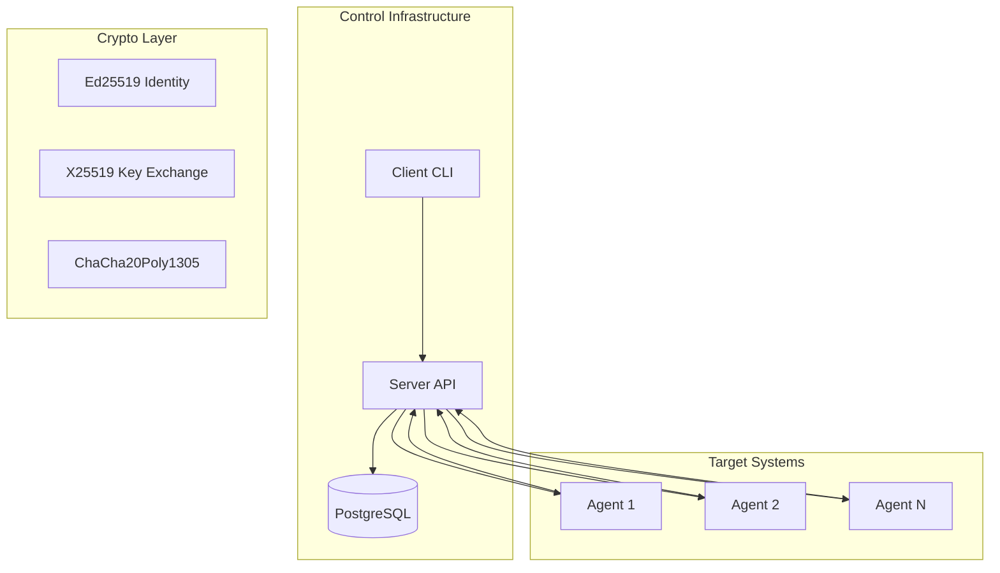
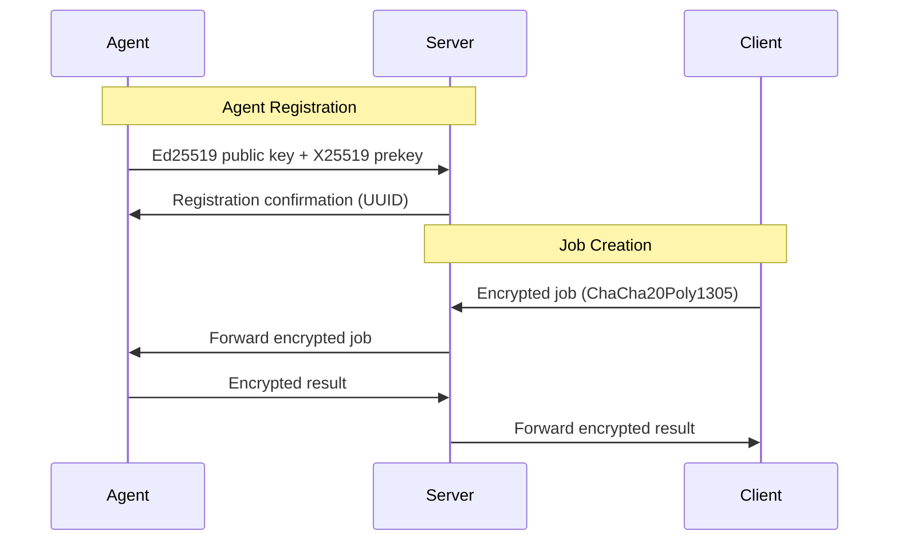

# AGENTS.md

This file provides guidance to AGENTS (AI coding assistants) when working with code in this repository.

## Project Overview

VenomMonkey is a distributed multiplatform beacon system designed to emulate threat actor capabilities. It consists of four Rust workspace crates:

- **agent**: Cross-platform beacon agent that runs on target systems (daemonized)
- **client**: CLI management tool for controlling agents and executing commands
- **server**: HTTP API server with PostgreSQL backend for agent/job coordination
- **common**: Shared types, API structures, and cryptographic utilities

## Architecture

The system follows a client-server-agent architecture with end-to-end encryption:



### Component Responsibilities

- **Server**: RESTful API using Warp framework, SQLx for PostgreSQL, agent lifecycle management
- **Agent**: Beacons using ureq HTTP client, platform-specific persistence (registry/daemon), single-instance enforcement
- **Client**: Clap-based CLI with reqwest HTTP client for server communication
- **Common**: Shared serde types for API, cryptographic primitives (Ed25519, X25519, ChaCha20Poly1305)

## Build Prerequisites

### Rust Toolchain

```bash
# Install Rust stable toolchain
rustup toolchain install stable
rustup component add clippy rustfmt
rustup default stable
```

### Cross-Compilation Support

```bash
# Install cross for multi-platform builds
cargo install cross --locked

# Add required targets
rustup target add x86_64-unknown-linux-musl
rustup target add x86_64-pc-windows-gnu
rustup target add aarch64-apple-darwin
```

### Platform-Specific Dependencies

#### Linux (Debian/Ubuntu)

```bash
sudo apt update
sudo apt install build-essential pkg-config libssl-dev upx-ucl
```

#### macOS

```bash
# Install Xcode command line tools
xcode-select --install

# Install dependencies via Homebrew
brew install upx
```

#### Windows

```bash
# Using winget (preferred)
winget install Rustlang.Rust.MSVC
winget install Git.Git
winget install Microsoft.VisualStudio.2022.BuildTools
```

## Build Commands

### Quick Build (Native)

```bash
# Build all components for current platform
make build

# Development server with auto-reload
make dev
```

### Multi-Platform Build

```bash
# Build all agent variants (Linux, Windows, macOS)
make build_all

# Individual platform builds
make agent_linux    # x86_64-unknown-linux-musl + UPX compression
make agent_windows  # x86_64-pc-windows-gnu + UPX compression
make agent_macos    # aarch64-apple-darwin
```

### Individual Component Builds

```bash
# Server (PostgreSQL required)
cargo build -p server --release

# Client CLI
cargo build -p client --release

# Agent (current platform)
cargo build -p agent --release
```

### Docker Build

```bash
make docker  # Builds venom_monkey:latest image
```

## Development Tasks

### Linting and Formatting

```bash
# Format code
make fmt
cargo fmt --all

# Strict linting (recommended)
cargo clippy --all-targets --all-features -- -D warnings

# Check formatting
cargo fmt --all -- --check
```

### Testing

```bash
# Run all tests
cargo test --all-features

# Integration tests should include:
# - Agent registration flow
# - Job creation and execution
# - Cryptographic key exchange
# - Platform-specific persistence
```

### Database Operations (Server)

```bash
# Database migrations are in server/db/migrations/
# Run migrations: sqlx migrate run
# Requires DATABASE_URL environment variable
```

## Configuration

### Environment Variables

| Variable | Component | Description | Default |
|----------|-----------|-------------|---------|
| `DATABASE_URL` | server | PostgreSQL connection string | - |
| `BIND_ADDR` | server | Server listen address | `0.0.0.0:3000` |
| `SERVER_URL` | agent/client | Server endpoint URL | - |
| `AGENT_SLEEP_INTERVAL` | agent | Beacon interval (seconds) | `300` |

### Agent Configuration Patterns

- **Linux**: `/etc/venom_monkey/` or `~/.config/venom_monkey/`
- **Windows**: Registry keys under `HKLM\Software\VenomMonkey`
- **macOS**: `~/Library/Application Support/VenomMonkey/`

## Security Architecture

The system implements defense-in-depth cryptography:



Key features:

- **Identity**: Ed25519 signatures for agent authentication
- **Key Exchange**: X25519 ephemeral keys per job
- **Encryption**: ChaCha20Poly1305 AEAD for job payloads
- **Integrity**: BLAKE2 hashing for data verification

## Development Workflow

### Recommended Justfile (DRY Approach)

While the project currently uses a Makefile, here's a recommended justfile for better developer experience:

```just
# Install development dependencies
setup:
    rustup component add clippy rustfmt
    cargo install cross --locked
    @just install-upx

# Format all code
fmt:
    cargo fmt --all

# Check formatting
fmt-check:
    cargo fmt --all -- --check

# Run clippy with strict warnings
clippy:
    cargo clippy --all-targets --all-features -- -D warnings

# Combined linting
lint: fmt-check clippy

# Run all tests
test:
    cargo test --all-features

# Build for current platform
build:
    cargo build --release

# Build all agent variants
[linux]
build-all-linux:
    @just agent-linux
    @just agent-windows

[macos]
build-all-macos:
    @just agent-macos
    @just agent-windows

[windows]
build-all-windows:
    @just agent-windows

# Cross-compile Linux agent
agent-linux:
    cross build -p agent --release --target x86_64-unknown-linux-musl
    upx -9 target/x86_64-unknown-linux-musl/release/agent
    mv target/x86_64-unknown-linux-musl/release/agent target/agent.linux_x86_64

# Cross-compile Windows agent
agent-windows:
    cross build -p agent --release --target x86_64-pc-windows-gnu
    upx -9 target/x86_64-pc-windows-gnu/release/agent
    mv target/x86_64-pc-windows-gnu/release/agent target/agent.windows_x86_64

# Build macOS agent
agent-macos:
    cross build -p agent --release --target aarch64-apple-darwin
    mv target/aarch64-apple-darwin/release/agent target/agent.macos_aarch64

# Development server
dev:
    cargo watch -x 'run -p server'

# Docker build
docker:
    docker build -t venom_monkey:latest .

# Clean build artifacts
clean:
    cargo clean

# Install UPX based on OS
[linux]
install-upx:
    sudo apt install upx-ucl

[macos]
install-upx:
    brew install upx

[windows]
install-upx:
    winget install upx.upx

# Justfile linting
just-lint:
    just --fmt --check --unstable
```

## Testing Strategy

### Recommended Testing Approach

Add these dependencies for comprehensive testing:

```toml
[dev-dependencies]
criterion = "0.5"        # Benchmarking
insta = "1.34"          # Snapshot testing
tokio-test = "0.4"      # Async testing utilities
wiremock = "0.5"        # HTTP mocking for client tests
```

### Test Examples

#### Snapshot Testing with insta

```rust
#[cfg(test)]
mod tests {
    use insta::assert_json_snapshot;
    use crate::common::api::RegisterAgent;

    #[test]
    fn test_register_agent_serialization() {
        let agent = RegisterAgent {
            identity_public_key: [1u8; 32],
            public_prekey: [2u8; 32],
            machine_id: "test-machine".to_string(),
            host_name: "test-host".to_string(),
            public_prekey_signature: vec![3u8; 64],
        };

        assert_json_snapshot!("register_agent", &agent);
    }
}
```

#### Benchmarking with criterion

```rust
// benches/crypto.rs
use criterion::{criterion_group, criterion_main, Criterion};
use venom_monkey_common::crypto;

fn bench_key_generation(c: &mut Criterion) {
    c.bench_function("ed25519_keypair", |b| {
        b.iter(|| crypto::generate_ed25519_keypair())
    });
}

criterion_group!(benches, bench_key_generation);
criterion_main!(benches);
```

## Code Quality Standards

### Strict Linting Enforcement

```bash
# This should pass with zero warnings
cargo clippy --all-targets --all-features -- -D warnings
```

### Security Auditing

```bash
# Install audit tools
cargo install cargo-audit cargo-deny

# Run security audit
cargo audit

# Check licenses and dependencies
cargo deny check
```

## Cross-Platform Considerations

### Agent Platform Differences

- **Linux**: Uses `daemonize` crate for daemon creation
- **Windows**: Registry persistence via `winreg` crate
- **macOS**: Native daemon support through launchd

### Conditional Compilation Patterns

```rust
#[cfg(target_os = "windows")]
use winreg::RegKey;

#[cfg(target_family = "unix")]
use daemonize::Daemonize;

// Platform-specific features
cfg_iif! {
    if target_os == "windows" {
        // Windows-specific code
    } else if target_family == "unix" {
        // Unix-specific code
    }
}
```

## Cursor Rules Integration

This project follows established patterns defined in `.cursor/rules/`:

- **project-structure.mdc**: Workspace organization and build system
- **rust-conventions.mdc**: Error handling, async patterns, security practices
- **server-patterns.mdc**: Warp framework, PostgreSQL, REST API design
- **agent-patterns.mdc**: Cross-platform daemon patterns, HTTP client usage
- **client-patterns.mdc**: CLI design with clap, API client patterns
- **common-patterns.mdc**: Shared utilities and cryptographic types

Always reference these cursor rules for component-specific guidance and maintain consistency with established patterns.

## Contributing Guidelines

### Code Review Process

- All changes require appropriate tests (unit, integration, or platform-specific)
- Follow conventional commits: `feat(agent): add beacon jitter support`

### Milestones and Versioning

- Milestones are named as version numbers (e.g., `v1.0`)
- Milestone descriptions provide context about the release scope
- Use semantic versioning for releases

### Security Requirements

- Never commit secrets, API keys, or credentials
- Use `zeroize` crate for sensitive memory cleanup
- All cryptographic operations must use established libraries (dalek crates)
- Agent identities should be based on machine UIDs for uniqueness

## Known Issues and TODOs

From the project README, current priorities include:

- [ ] Fix breaking changes in crypto crates (client and agent)
- [x] Update outdated clap dependency in client
- [ ] Implement user management for clients
- [ ] Add consistent agent IDs using machine IDs
- [x] Agent hostname and machine ID reporting on registration
- [ ] Change agent behavior to proper beaconing vs long-polling
- [ ] Add "bugout" command for agent emergency exit

## Troubleshooting

### Build Issues

- **UPX not found**: Install UPX per platform instructions above
- **Cross-compilation fails**: Ensure Docker is running for cross builds
- **Windows builds fail**: Install Visual Studio Build Tools with C++ workload

### Runtime Issues

- **Agent registration fails**: Check SERVER_URL environment variable
- **Database connection errors**: Verify DATABASE_URL and PostgreSQL service
- **Permission denied (Linux)**: Agent may need elevated privileges for daemon creation

### Development Issues

- **Server won't start**: Check if port 3000 is available or set BIND_ADDR
- **Tests fail intermittently**: May indicate race conditions in async code
- **Clippy warnings**: Use `-- -D warnings` flag to enforce zero-warning policy

## Mermaid Diagram Usage

This project prefers mermaid diagrams for all visual documentation. When adding new diagrams:

1. Place them inline in Markdown files
2. Use descriptive titles and labels
3. Reference specific modules and crates in annotations
4. Validate rendering in VS Code or GitHub preview

Example diagram patterns used in this project:

- Component/container diagrams for architecture overview
- Sequence diagrams for protocol flows
- State diagrams for agent lifecycle
- Flowcharts for decision trees
